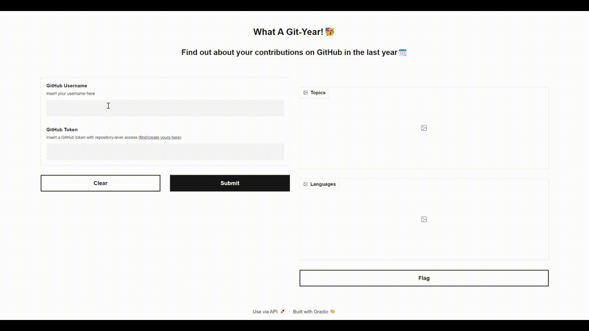

# What A Git-Year!


**What A Git-Year!** is a simple Gradio app to showcase your GitHub achievements in the past year. 

You just need to provide your username and a token with repository-level access ([find/create yours here](https://github.com/settings/tokens)) and the magic will be done in less than a minute!



## Run it locally

You can install the app from source code and run it locally:

```bash
git clone https://github.com/AstraBert/what-a-git-year.git
cd what-a-git-year/
python3 -m venv gityear
source gityear/bin/activate
python3 -m pip install -r requirements.txt
python3 app.py
```

And the app should be up and running on http://localhost:7860 in no time!

## Run it with Docker

Use the GitHub Container Registry Docker image to run the application:

```bash
docker pull ghcr.io/astrabert/what-a-git-year:main
docker run -p 7860:7860 ghcr.io/astrabert/what-a-git-year:main
```

The app should be available on http://localhost:7860 in less than one minute!

## Use the HuggingFace Demo

Find a [demo on HuggingFace Spaces](https://huggingface.co/spaces/as-cle-bert/what-a-git-year)

## Contributions

Contributions are more than welcome! See [contribution guidelines](./CONTRIBUTING.md) for more information :)

## Funding

If you found this project useful, please consider to [fund it](https://github.com/sponsors/AstraBert) and make it grow: let's support open-source together!😊


## License and rights of usage

This project is provided under [MIT license](./LICENSE): it will always be open-source and free to use.

If you use this project, please cite the author: [Astra Clelia Bertelli](https://astrabert.vercel.app)

